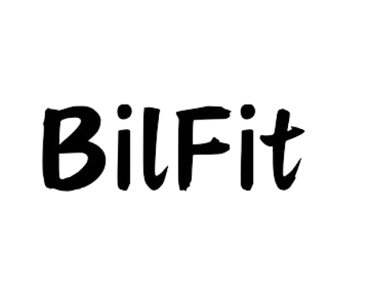

# BilFit

# Introduction

BilFit is a mobile app designed to promote healthy living through personalized exercise programs and progress tracking. By tailoring programs to individual needs and aspirations, BilFit helps users overcome the uncertainty of whether to exercise each day. It also fosters friendly competition through a leaderboard based on progress, motivating users to push themselves further. With features like adding friends and sending notifications, BilFit encourages social interaction among users. The app includes essential screens such as sign-up, sign-in, and password recovery, as well as a convenient menu with access to program details and social features.

# Setup
You can download our application using the following link on any Android phone without requiring any plugins or additional applications.

Download link for the app:

# Techs used
    Android Studio
    Firebase

# Dependicies
    
    implementation(platform("com.google.firebase:firebase-bom:32.8.0"))
    implementation("com.google.firebase:firebase-analytics")
    implementation("com.google.firebase:firebase-storage")
    implementation("com.google.firebase:firebase-firestore")
    implementation("com.google.firebase:firebase-auth")
    implementation("com.google.firebase:firebase-database")
    implementation("com.google.android.material:material:1.9.0")
    implementation ("com.github.bumptech.glide:glide:4.12.0")
    implementation(libs.appcompat)
    androidTestImplementation(libs.ext.junit)
    androidTestImplementation(libs.espresso.core)

# Contributions

  Altan Altay  
  Mehmet Akif Yavuz  
  Oğuzhan Demir  
  Serdar Kara  
  Yusuf Bedri Bitiren  

# Personal Logs
Serdar Kara 

1 - 7 April: Main Activity 
8 - 14 April: Main Activity 
15 - 21 April: Main Activity 
22 - 28 April: Program Activity 
29 April - 5 May: Program Activity 
6 - 12 May: Settings Activity and related Activities 

Mehmet Akif Yavuz 

1 - 7 April: GUI design, 2 - 3 hours roughly 
8 - 14 April: GitHub Connection and User class, 5 - 6 hours roughly 
15 - 21 April: Friends Activity, 5 hours 
22 - 28 April: Friends Activity, 2 - 3 hours 
29 April - 5 May: Gui design of friends related screens, 5 hours 
6 - 12 May: Edit Friends Activity, Notifications Activity, 4 hours 

Yusuf Bedri Bitiren
    
1 - 7 April: Initial project setup, UI design, skeletons for Exercises, 2-3 hours roughly 
8 - 14 April: FeedbackActivity, Algorithm structure, initial tests, 5-6 hours roughly 
15 - 21 April: Continued Algorithm development, began UserInfoHolder implementation, refined UI design, 5 hours 
22 - 28 April: Exercises, UserInfoHolder, improved UI elements, 2-3 hours 
29 April - 5 May: Testing and debugging, refined Algorithm and UserInfoHolder, 5 hours 
6 - 12 May: FeedbackActivity and Exercises, 4 hours 
13 - 18 May: Finalized classes, 3-4 hours 

Oğuzhan Demir

1 - 7 April: GUI Design, Drawables 
8 - 14 April: GUI Desig , User Info Pagesn 
15 - 21 April: GUI Design, User Info Pages 
22 - 28 April: GUI Design Leaderboard Activity 
29 April - 5 May: Leaderboard Activity, Report Activity 
6 - 12 May: Report Activity, GUI Design 

    

  
